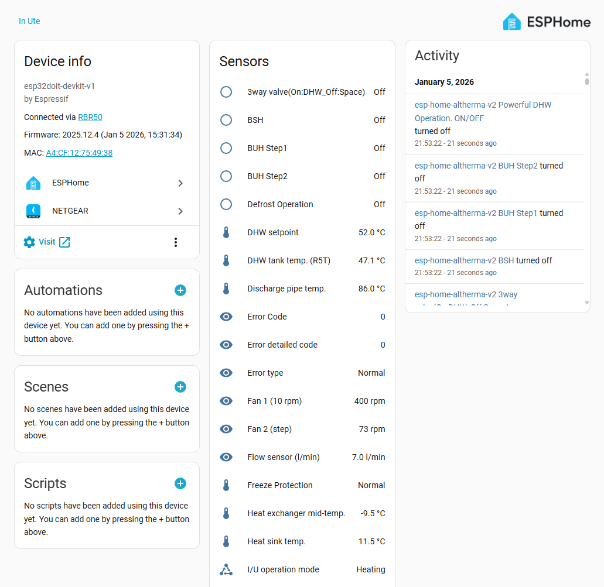
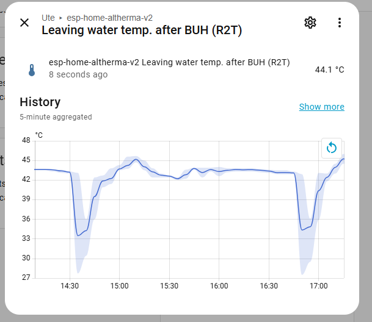
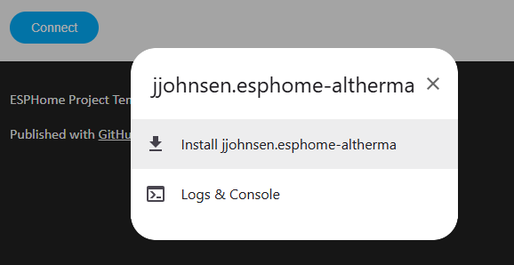
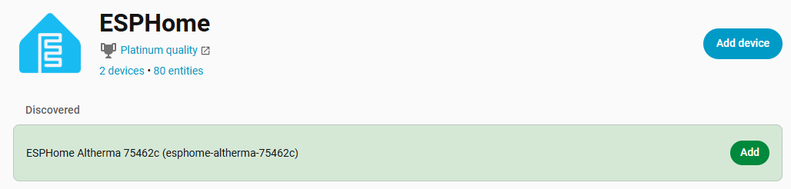

# ESPHome Altherma

An ESPHome-based implementation inspired by [ESPAltherma](https://github.com/raomin/ESPAltherma).

This project provides a custom ESPHome component for communicating with Daikin Altherma heat pumps via the X10A connector. It exposes temperatures, voltages, currents, and other operational data to Home Assistant.

The integration enables real-time monitoring of Daikin Altherma units using ESPHome and the native Home Assistant API.




## Features

* Real-time sensor data (temperature, voltage, current, etc...)
* Model-specific configuration for different Altherma units
* Mock UART mode for development and testing
* OTA updates support

## Hardware Requirements

* ESP32 development board (ESP8266 may also work)
* Daikin Altherma heat pump with X10A connector
* 5-pin JST EH 2.5 mm connector or 4 Dupont M-F wires

### Wiring

Connect the ESP32 to the Altherma unit using the X10A connector:

| X10A    | [ESP32](https://www.espboards.dev/esp32/esp32doit-devkit-v1/) | [M5Stack AtomS3 Lite](https://docs.m5stack.com/en/core/AtomS3%20Lite)
| --      | --                                       | --
| 1 - 5V  | 5V / VIN (ESP supply voltage)            | 5V
| 2 - TX  | RX_PIN (default GPIO 16, preferably RX2) | G1
| 3 - RX  | TX_PIN (default GPIO 17, preferably TX2) | G2
| 4 - NC  | Not connected                            | Not connected
| 5 - GND | GND                                      | G

Refer to the [ESPAltherma wiring guide](https://github.com/raomin/ESPAltherma?tab=readme-ov-file#daikin-altherma-4-pin-x10a-connection) for additional details.

## Successfull installs

| Board                  | Heat pump                                | User      | Additional info
| --                     | --                                       | --        | --
| Generic esp32dev board | ERGA08DAV3 / EHVH08S23DA6V               | @jjohnsen | This repo ;)
| M5Stack AtomS3 Lite    | DAIKIN Altherma 3 R Ech2o / EHSXB08P30EF | @maromme  | https://github.com/jjohnsen/esphome-altherma/discussions/4
| DOIT ESP32 DEVKIT V1   | EHVX08S26CB9W                            | @MaBeniu  | https://github.com/jjohnsen/esphome-altherma/discussions/5
| esp32dev | ERLQ011CAV3 / EHBX11CB9W || [Detailed setup guide in French](https://domo.rem81.com/index.php/2026/01/12/ha-monitoring-de-ma-pac-daikin-altherma-avec-esphome-esphome-altherma-alternative-a-espaltherma/)

## Installation

⚠️ Warning: Right now only a mapping file for the Altherma (ERGA D EHV-EHB-EHVZ DA series 04-08kW) heat pump exists, as it is the one I have at home. Contributions for other models are welcome!

### Install through the browser / ESP Web Tools

* Open https://rsre.github.io/esphome-altherma/ and click **Connect**:
  
* Follow the guided installation process:
  * Install firmware
  * Connect to Wi-Fi
  * Add to Home Assistant
    

For more information about ESP Web Tools, visit: [ESP Web Tools](https://esphome.github.io/esp-web-tools/)

#### Updating

* Connect your developer board to your computer
* Open https://rsre.github.io/esphome-altherma/ and click **Connect**
* Select Update

### Install using command line tools

* [ESPHome installed](https://esphome.io/guides/getting_started_command_line/)
* Clone this repository
* Edit esphome-altherma-esp32.yaml and configure your Wi-Fi credentials and other changes:
```
  wifi:
     ssid: "YourWiFiSSID"
     password: "YourWiFiPassword"
```
* Connect your ESP32 via USB and compile/upload the firmware:

```
  python -m esphome run esphome-altherma-esp32.yaml
```
* After the initial flash, subsequent updates can be done wirelessly (OTA)

## Configuration

### Model Files (confs/*.yaml)

Model files define the available sensors for specific Altherma units.

**Available models:**
- `erga_eh_da_04_08.yaml` - ERGA-D EHV/EHB/EHVZ DA series (04-08kW)

## Development

### Mock UART Mode

For development without physical hardware, enable mock UART mode:

```yaml
esphome:
  platformio_options:
    build_flags:
      - -DUSE_MOCK_UART
```

This allows testing the component logic without an actual Altherma connection.

### Vendored ESPAltherma Files

This project contains selected files from the [ESPAltherma repository](https://github.com/raomin/ESPAltherma)

- Files used:
  - `include/converters.h`
  - `include/labeldef.h`
- Location:
  - `custom_components/altherma_hub/lib/`

**Updating Vendored Files**

To update the vendored files from the upstream ESPAltherma repository:
```bash
# Add ESPAltherma as a remote (one-time setup)
git remote add espaltherma https://github.com/raomin/ESPAltherma.git

git fetch espaltherma
git checkout espaltherma/main -- include/converters.h
git checkout espaltherma/main -- include/labeldef.h

git mv -f include/converters.h custom_components/altherma_hub/lib/converters.h
git mv -f include/labeldef.h custom_components/altherma_hub/lib/labeldef.h

git commit -m "Update ESPAltherma vendored files"
rmdir include
```

## License

This project is provided as-is for educational and personal use.

Please respect the licenses of the dependencies:
* ESPAltherma files are subject to their original license
* ESPHome is licensed under the MIT License

## Credits

- Based on [ESPAltherma](https://github.com/raomin/ESPAltherma) by raomin
- Built with [ESPHome](https://esphome.io/)
- Integrates with [Home Assistant](https://www.home-assistant.io/)
